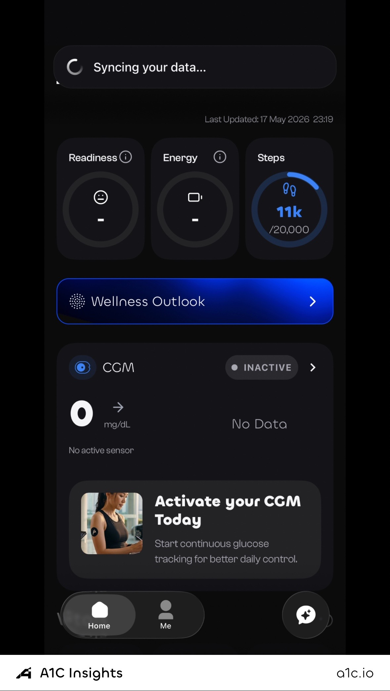
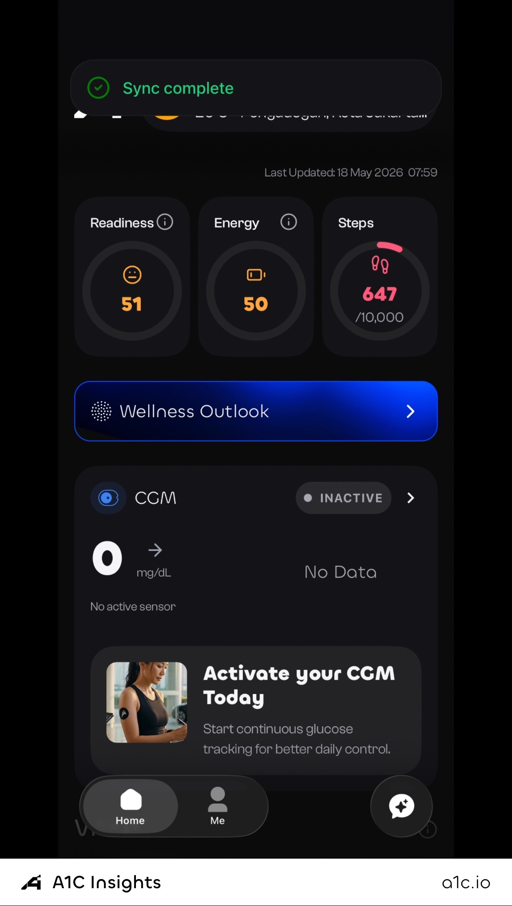

# Sally Skills

Plug Sally's metabolic-health intelligence into your AI agent. Six skills,
per-call pricing, one MCP server. Works with Claude Code, Claude Desktop,
Cursor, OpenClaw, Hermes, Manus, Perplexity, or any tool that speaks REST.

## Section 1. Onboarding

Before your agent can call any Sally skill, you (the human) need an A1C
account and an API key. Two steps.

### Step 1. Install A1C Insights and create your account

1. Open the App Store on your iPhone.
2. Search for **A1C Insights** and install it, or open
   <https://apps.apple.com/id/app/a1c-insights/id6748399956> on your phone.
3. Open the app and tap **Sign Up**. You can use *Sign in with Apple* or
   email + password.
4. Walk through onboarding (your basics, goals, optional wearables). This
   creates your A1C user account. Every skill key is bound to one A1C
   account.

<p align="center">
  
  &nbsp;
  
</p>

> Visual walkthrough with annotated screenshots:
> <https://console.a1c.io/docs.html#quickstart>.

> Why iOS first? Skills like `metabolic_overview`, `health_insights`, and
> `health_sync` read CGM and wearable data the iPhone app collects via
> HealthKit. You can still use `chat_with_sally`, `analyze_lab_result`,
> and `food_journal` without any wearable data, but the account itself is
> created on the iOS app.

### Step 2. Mint your API key on console.a1c.io

1. Visit <https://console.a1c.io> in any browser.
2. Sign in with the same A1C account you created in step 1.
3. Open **API Keys**, click **Create new key**, name it (e.g. "Claude
   Code on my laptop"), and click **Generate**.
4. **Copy the key now.** It starts with `sk-sally-…` and is shown only
   once. If you lose it, revoke and re-issue.

You can mint multiple keys per A1C account, one per agent or device, and
they all share the same wallet balance. Per-key usage stays auditable.

That's section 1 done. You now have:

* An A1C account linked to your iPhone app data.
* A funded wallet.
* An `sk-sally-…` API key on your clipboard.

## Section 2. Use your key from any agent

You have one key. Three ways to call Sally with it. Most agents only
need the MCP path. Pick that unless you're scripting from the command
line.

### 2a. The skill catalog

These six skills go live the moment your key works:

| Skill                | Cost / call | What it does                                                              | Detail                                              |
| -------------------- | ----------- | ------------------------------------------------------------------------- | --------------------------------------------------- |
| `health_sync`        | **FREE**    | Pull your wearable, CGM, sleep, vitals, activity, and environment data.   | [64 fields](catalog/health-sync.md)                 |
| `chat_with_sally`    | $0.003      | Talk to Sally about preventive health and TCM with source citations.      | [usage](catalog/chat-with-sally.md)                 |
| `analyze_lab_result` | $0.008      | Upload a lab PDF or image; get parsed biomarkers + clinical reading.      | [usage](catalog/analyze-lab-result.md)              |
| `food_journal`       | $0.004      | Snap a photo of your meal; get macros and smart/trap categorisation.      | [usage](catalog/food-journal.md)                    |
| `health_insights`    | $0.003      | Morning, afternoon, or evening readout from your last day of data.        | [usage](catalog/health-insights.md)                 |
| `metabolic_overview` | $0.005      | CGM snapshot for a date: TIR, variability, spikes, and a narrative.       | [usage](catalog/metabolic-overview.md)              |

See [`catalog/`](catalog/) for the full per-skill data breakdown.

### 2b. Three ways to call

| Path               | Best for                                                                                 | Setup                                                              |
| ------------------ | ---------------------------------------------------------------------------------------- | ------------------------------------------------------------------ |
| **MCP**            | Any modern AI agent (Claude, Cursor, OpenClaw, Hermes, Manus, Perplexity, others).       | One JSON config block, restart agent, tools appear automatically.  |
| **REST API**       | Bash scripts, your own apps, anything that can `curl`.                                   | One HTTP POST per call.                                            |
| **Per-skill REST** | Same as REST, slightly cleaner URL per skill.                                            | `/v1/skills/<name>`                                                |

See [`protocols/mcp.md`](protocols/mcp.md) for the universal MCP setup,
[`protocols/api.md`](protocols/api.md) for raw REST calls, and
[`agents/`](agents/) for per-agent quick-starts.

### 2c. Auto-routing for agents and CLIs

Want your agent to pick the right Sally skill for any request without
you having to think about it? Drop [`SKILL.md`](SKILL.md) into the
agent's system prompt or instructions field. It's a single file with
deterministic routing rules, decision tables, chaining patterns, and
anti-patterns. Works with any LLM-based agent or rule-based CLI.

See [`SKILL.md`](SKILL.md) for the full agent decision layer.

### 2d. The 30-second smoke test

Confirm your key works before configuring any agent:

```bash
curl -sS https://sally.a1c.io/v1/call \
  -H "Authorization: Bearer sk-sally-…" \
  -H "Content-Type: application/json" \
  -d '{"skill":"health_sync","input":{}}' | jq .ok
# → true
```

`true` means your key is live and can call the free `health_sync` skill.
You're ready.

## Per-agent guides

Pick the agent you actually use:

* [Claude Code](agents/claude-code.md). Terminal coding assistant.
* [Claude Desktop](agents/claude-desktop.md). macOS / Windows app.
* [OpenClaw](agents/openclaw.md). Open-source agent CLI.
* [Hermes](agents/hermes.md). Agent runtime.
* [Manus](agents/manus.md). Chinese agent platform.
* [Perplexity](agents/perplexity.md). Search-first AI.

Don't see your agent? Most modern agents support MCP. See
[`protocols/mcp.md`](protocols/mcp.md) and use the universal config.

## Pricing and wallet

* Per-call pricing, no subscription. See the table above. `health_sync`
  is permanently free.
* Wallet check is enforced before any call. Paid skills return
  `402 payment_required` if your balance is below the price, so there
  are no surprise charges.
* Top up via Stripe at <https://console.a1c.io/billing>. Card payments
  in USD.
* Every call writes an immutable row to your usage history. See it in
  `console.a1c.io` under **Usage**.

## Privacy and security

* Your key is your identity. Sally never accepts `user_uuid`, `email`,
  or any other identifier from your agent's request body, only the
  `Authorization: Bearer sk-sally-…` header. No agent can impersonate
  another user.
* Lab PDFs and meal photos are never persisted by Sally. They flow
  agent → gateway → AI service → response, with no S3 or GCS upload.
* Output schemas are allowlists. Sally's response only ever contains
  the fields explicitly named in each skill's docs. No accidental column
  leak from internal databases.
* Revoke instantly at `console.a1c.io` under **API Keys → Revoke**. The
  old key becomes invalid on its next request.

## Help

* Skill catalog with field-level docs: [`catalog/`](catalog/)
* Auto-routing layer: [`SKILL.md`](SKILL.md)
* Email: <ai@sallya1c.com>
