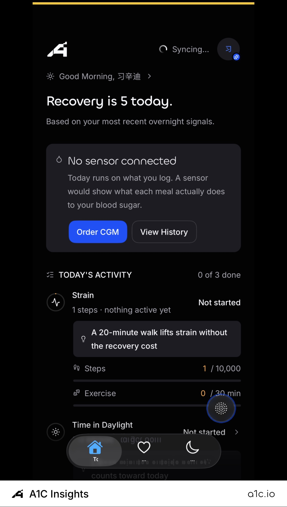
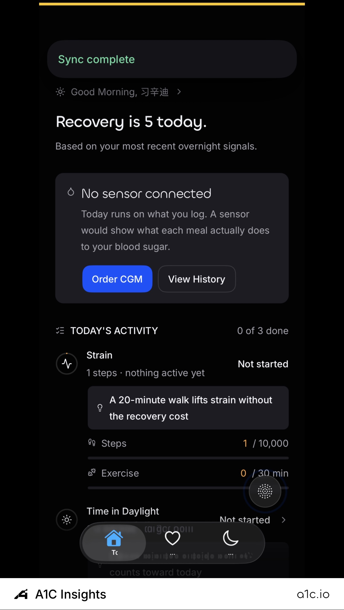

# Sally Skills

Sally is specialized intelligence in metabolic health. Sally Skills lets developers integrate Sally's specialized capabilities into AI agents through [Sally Console](https://console.a1c.io) using REST APIs and MCP.

Available capabilities include:

- 🩸 **Health Context** — Understand 64+ biomarkers, including blood glucose, HbA1c, sleep, activity, vital signs, and environmental signals.
- 🧪 **Lab Analysis** — Transform laboratory results into clinically meaningful metabolic health insights.
- 💊 **Supplement Stack Scoring** — Score and evaluate supplement stacks for quality, effectiveness, and metabolic health considerations.
- 🥗 **Nutrition Analysis** — Analyze meals and nutrients, identify healthier choices, and detect potential metabolic traps.
- 📈 **Metabolic Overview** — Interpret continuous glucose monitor (CGM) data to reveal glucose patterns and metabolic health trends.
- 🌤️ **Daily Insights** — Summarize daily health using sleep, vital signs, activity, and environmental data with personalized insights.
- 🩻 **Chest & Fracture X-ray Analysis** — Analyze chest and musculoskeletal X-rays to assist in identifying clinically relevant
  findings.
- 📚 **Longevity Knowledge** — Access Sally's curated metabolic health and longevity knowledge, combining evidence from Western medicine and
  Traditional Chinese Medicine (TCM).

Compatible with Claude Code, Claude Desktop, Cursor, OpenClaw, Hermes, Manus, Perplexity, and any AI framework that supports REST APIs or MCP.

## The Ecosystem

- **Sally** — The AI specialized in metabolic health and longevity.
- **A1C Insights** — The consumer app where users connect their health data and chat with Sally through [Ask Sally](https://a1c.io).
- **Sally Console** — The [developer platform](https://console.a1c.io) for integrating Sally's capabilities into AI agents through REST APIs and MCP.

## Section 1. Onboarding

Before your agent can call any Sally skill, you (the human) need an API key. There are two ways in,
and you can start with either.

### Path A. Start in the console (fastest)

1. Visit <https://console.a1c.io> and sign up with Apple or Google. No app install, no waitlist.
2. Open **API Keys**, click **Create new key**, name it (e.g. "Claude Code on my laptop"), and click **Generate**.
3. **Copy the key now.** It starts with `sk-sally-…` and is shown only once. If you lose it, revoke and re-issue.

This gives you a working key immediately, with access to Sally's specialized reasoning and the
curated metabolic and longevity knowledge base.

What a console-only key can call today:

| skill | works without biomarkers |
| --- | --- |
| `chat_with_sally` | yes |
| `analyze_lab_result` | yes |
| `food_journal` | yes |
| `supplement_grading` | yes |
| `search_health_knowledge` | yes, free |
| `lookup_supplement_grade` | yes, free |
| `lookup_food` | yes, free |
| `health_sync` | needs biomarkers |
| `health_insights` | needs biomarkers |
| `metabolic_overview` | needs biomarkers |

The last three read your own CGM and wearable data, so without it they return a typed
`no_health_data` error immediately and charge you nothing. Connect your biomarkers in path B and they
start answering.

### Path B. Add your own biomarkers with A1C Insights

Do this when you want answers about *your* glucose, sleep and labs rather than the domain in general.

1. Open the App Store on your iPhone.
2. Search for **A1C Insights** and install it, or open <https://apps.apple.com/id/app/a1c-insights/id6748399956> on your phone.
3. Sign in with the same account you used on the console, or tap **Sign Up** if you are starting here.
4. Walk through onboarding (your basics, goals, optional wearables) and connect a CGM or wearable.

<p align="center">
  
  &nbsp;
  
</p>

> Visual walkthrough with annotated screenshots:
> <https://console.a1c.io/docs.html#quickstart>.

Sally Console and A1C Insights run on the same backend, so your account and your key are the same on
both. Already on A1C Insights? Sign in to the console directly and your key works against data you
have already synced.

> Why iOS for biomarkers? Skills like `metabolic_overview`, `health_insights`, and `health_sync` read
> CGM and wearable data the iPhone app collects via HealthKit. Everything else works from a console
> account alone.

### Keys and billing

You can mint multiple keys per account, one per agent or device, and they all share the same wallet
balance. Per-key usage stays auditable. Top up with a card or with USDC on Base, or go unlimited
monthly.

That's section 1 done. You now have:

* An account, created wherever suited you.
* A funded wallet.
* An `sk-sally-…` API key on your clipboard.

## Section 2. Use your key from any agent

You have one key. Three ways to call Sally with it. Most agents only need the MCP path. Pick that unless you're scripting from the command
line.

### 2a. The skill catalog

These seven skills go live the moment your key works (live list on
[console.a1c.io](https://console.a1c.io)):

| Skill                       | Cost / call                    | What it does                                                               | Detail                                  |
| --------------------------- | ------------------------------ | -------------------------------------------------------------------------- | ---------------------------------------- |
| `supplement_grading` 🆕     | $0.008                         | Grade a supplement stack for interactions, evidence quality, and gaps.     | —                                        |
| `health_sync`               | 10 free / month, then $0.001   | Pull 64+ live biomarkers from wearables and CGM into your agent's context. | [64 fields](catalog/health-sync.md)      |
| `chat_with_sally`           | $0.003                         | Ask Sally anything across preventive health and TCM, evidence-graded.      | [usage](catalog/chat-with-sally.md)      |
| `analyze_lab_result`        | $0.008                         | Parse and interpret lab panels with risk flags and reference ranges.       | [usage](catalog/analyze-lab-result.md)   |
| `health_insights`           | $0.003                         | Morning, afternoon, and evening readouts from sleep, vitals, and activity. | [usage](catalog/health-insights.md)      |
| `food_journal`              | $0.004                         | Grade meals by macros and glucose-spike prediction, surfacing patterns.    | [usage](catalog/food-journal.md)         |
| `metabolic_overview`        | $0.005                         | Full CGM snapshot: time-in-range, variability, and postprandial curves.    | [usage](catalog/metabolic-overview.md)   |

Coming soon on the roadmap: `health_report`, `metabolic_risk_score`,
`xray_skills`, and `preventive_protocol`.

See [`catalog/`](catalog/) for the full per-skill data breakdown.

### 2b. Three ways to call

| Path               | Best for                                                                                 | Setup                                                              |
| ------------------ | ---------------------------------------------------------------------------------------- | ------------------------------------------------------------------ |
| **MCP**            | Any modern AI agent (Claude, Cursor, OpenClaw, Hermes, Manus, Perplexity, others).       | One JSON config block, restart agent, tools appear automatically.  |
| **REST API**       | Bash scripts, your own apps, anything that can `curl`.                                   | One HTTP POST per call.                                            |
| **Per-skill REST** | Same as REST, slightly cleaner URL per skill.                                            | `/v1/skills/<name>`                                                |

See [`protocols/mcp.md`](protocols/mcp.md) for the universal MCP setup,
[`protocols/api.md`](protocols/api.md) for raw REST calls, and
[`agents/`](agents/) for per-agent quick-starts.

### 2c. Auto-routing for agents and CLIs

Want your agent to pick the right Sally skill for any request without you having to think about it? Drop [`SKILL.md`](SKILL.md) into the
agent's system prompt or instructions field. It's a single file with deterministic routing rules, decision tables, chaining patterns, and
anti-patterns. Works with any LLM-based agent or rule-based CLI.

See [`SKILL.md`](SKILL.md) for the full agent decision layer.

### 2d. The 30-second smoke test

Confirm your key works before configuring any agent:

```bash
curl -sS https://sally.a1c.io/v1/call \
  -H "Authorization: Bearer sk-sally-…" \
  -H "Content-Type: application/json" \
  -d '{"skill":"health_sync","input":{}}' | jq .ok
# → true
```

`true` means your key is live and can call `health_sync` (your first 10
calls each month are free). You're ready.

## Grok Build plugin

This repo doubles as a [Grok Build](https://x.ai) plugin. Installing it wires
Grok to Sally's hosted MCP server; there is nothing to run locally.

| | |
|---|---|
| Network endpoint | `https://sally.a1c.io/mcp` (the only host this plugin contacts) |
| Transport | MCP over HTTP |
| Credentials | None for the free tools. Account-scoped skills need an `sk-sally-…` key from [console.a1c.io](https://console.a1c.io) |
| Manifest | [`.mcp.json`](.mcp.json), [`.grok-plugin/plugin.json`](.grok-plugin/plugin.json) |
| Bundled skills | [`skills/`](skills/) |

The plugin exposes the three free, account-free skills:
[`search_health_knowledge`](catalog/search-health-knowledge.md),
[`lookup_supplement_grade`](catalog/lookup-supplement-grade.md), and
[`lookup_food`](catalog/lookup-food.md). It reads no local files, runs no
install scripts, and sends nothing anywhere except the query text you pass to
a tool. The personal skills that read your own biomarkers stay behind an API
key by design.

---

## Per-agent guides

Pick the agent you actually use:

* [Claude Code](agents/claude-code.md). Terminal coding assistant.
* [Claude Desktop](agents/claude-desktop.md). macOS / Windows app.
* [OpenClaw](agents/openclaw.md). Open-source agent CLI.
* [Hermes](agents/hermes.md). Agent runtime.
* [Manus](agents/manus.md). Chinese agent platform.
* [Perplexity](agents/perplexity.md). Search-first AI.

Don't see your agent? Most modern agents support MCP. See
[`protocols/mcp.md`](protocols/mcp.md) and use the universal config.

## Pricing and wallet

* Per-call pricing, no subscription. See the table above. `health_sync` includes 10 free calls per month, then $0.001 per call.
* Wallet check is enforced before any call. Paid skills return
  `402 payment_required` if your balance is below the price, so there are no surprise charges.
* Top up via Stripe at <https://console.a1c.io/billing>. Card payments in USD.
* Every call writes an immutable row to your usage history. See it in `console.a1c.io` under **Usage**.

## Privacy and security

* Your key is your identity. Sally never accepts `user_uuid`, `email`, or any other identifier from your agent's request body, only the
  `Authorization: Bearer sk-sally-…` header. No agent can impersonate another user.
* Lab PDFs and meal photos are never persisted by Sally. They flow agent → gateway → AI service → response, with no S3 or GCS upload.
* Output schemas are allowlists. Sally's response only ever contains the fields explicitly named in each skill's docs. No accidental column leak from internal databases.
* Revoke instantly at `console.a1c.io` under **API Keys → Revoke**. The old key becomes invalid on its next request.

## Help

* Skill catalog with field-level docs: [`catalog/`](catalog/)
* Auto-routing layer: [`SKILL.md`](SKILL.md)
* Email: <ai@sallya1c.com>
